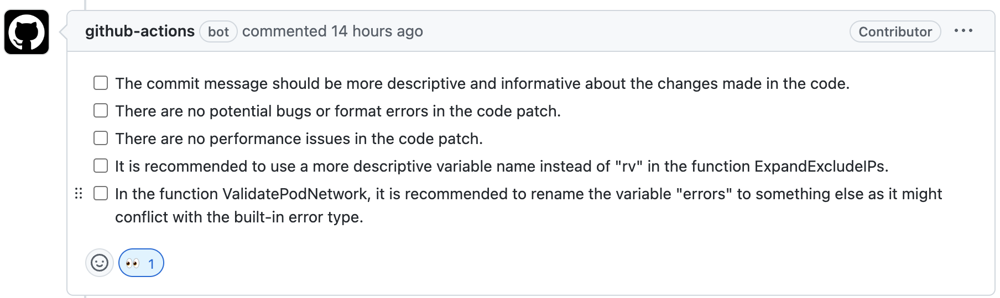

# Smart Review

This GitHub Action uses OpenAI to provide AI-powered code reviews. 
With this action, you can get feedback on your PR's, 
which can help you catch errors, performance issues and improve the overall quality of your codebase.
Users can also adjust the focus and output format of the review by modifying the `systemMessage`.

An example of AI review feedback looks like this:




This project was inspired by [anc95/ChatGPT-CodeReview](https://github.com/anc95/ChatGPT-CodeReview), 
the main differences are that it allows customizing the `systemMessage` to adjust the focus and output format of the AI review according to one's own needs. 
And it can be triggered from a forked pull request.

## Inputs

-  `apiKey` (required): The OpenAI API key.
-  `githubToken` (required): The GitHub token.
-  `model` (optional): The model used to review code. Defaults to `gpt-3.5-turbo`.
-  `temperature` (optional): The model temperature. Defaults to `0.1`.
-  `top_n` (optional): The model top_n. Defaults to `1`.
-  `systemMessage` (optional): The system message sent to the ChatGPT API, which allows you to focus on specific areas for review.

## Example Usage

You only need to set the secret `OPENAI_API_KEY` in your repo before running the action. The `GITHUB_TOKEN` secret will be set automatically by Github Action.

```yaml
name: Smart Review
permissions:
  contents: read
  pull-requests: write

on:
  pull_request_target:
    types: [opened, synchronize]

jobs:
  review-code:
    runs-on: ubuntu-latest
    steps:
      - name: test review
        uses: oilbeater/smart-review@main
        with:
          apiKey: ${{ secrets.OPENAI_API_KEY }}
          githubToken: ${{ secrets.GITHUB_TOKEN }}
```

In this example, the action will be triggered upon the opening of a pull request or the pushing of new commits, 
and will subsequently generate review feedback within the corresponding pull request thread.

*Notice:* If you don't want to use your `OPENAI_API_KEY` for review pr from forked repo, replace `pull_request_target` with `pull_request`.

## Limitation

- The Azure OpenAI endpoint is currently unsupported.
- A patch of significant size may exceed the token limit for OpenAI.
